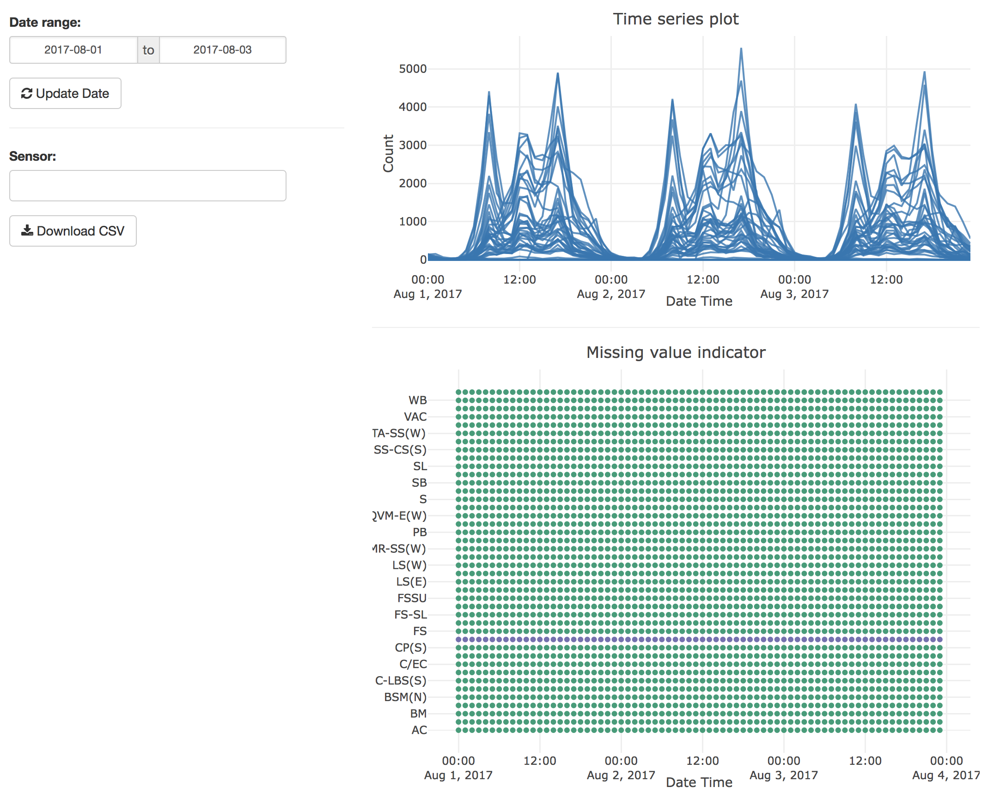

---
output:
  md_document:
    variant: markdown_github
---

<!-- README.md is generated from README.Rmd. Please edit that file -->

```{r, echo = FALSE}
knitr::opts_chunk$set(
  collapse = TRUE,
  comment = "#>",
  fig.path = "man/figure/"
)
```

[](https://travis-ci.org/earowang/rwalkr)
[](https://cran.r-project.org/package=rwalkr)
[](https://cran.r-project.org/package=rwalkr)

# rwalkr

The goal of **rwalkr** is to provide API to the pedestrian data from the City of Melbourne in tidy data form.

## Installation

You could install the stable version from CRAN:

```{r, eval = FALSE}
install.packages("rwalkr")
```

You could install the development version from Github using:

```{r, eval = FALSE}
# install.packages("devtools")
devtools::install_github("earowang/rwalkr")
```

## Usage

### `walk_melb()`

The `walk_melb()` function provides API using compedapi, where counts are uploaded on a daily basis. The starting and ending dates inform of which period to be pulled.

```{r data}
library(rwalkr)
start_date <- as.Date("2017-07-01")
end_date <- start_date + 6L
ped <- walk_melb(from = start_date, to = end_date)
head(ped)
```

Use *ggplot2* for visualisation:

```{r plot, fig.height = 4}
library(ggplot2)
ggplot(data = subset(ped, Sensor == "Melbourne Central")) +
  geom_line(aes(x = Date_Time, y = Count))
```

### `run_melb()`

The `run_melb()` function provides API using Socrata, where counts are uploaded on a monthly basis. It should pull the data much faster than the function `walk_melb()`.

```{r run, eval = FALSE}
run_melb(year = 2016:2017, sensor = NULL)
```

### `shine_melb()`

The function `shine_melb()` launches a shiny app to give a glimpse of the data. It provides two basic plots: one is an overlaying time series plot, and the other is a dot plot indicating missing values. Below is a screen-shot of the shiny app.


