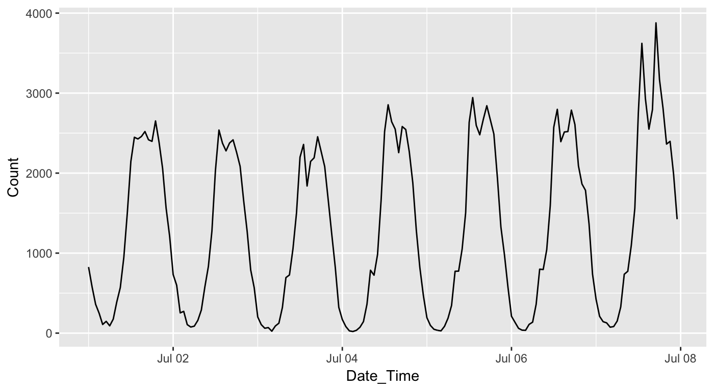

<!-- README.md is generated from README.Rmd. Please edit that file -->
[](https://travis-ci.org/earowang/walk) [](https://cran.r-project.org/package=walk)

walk
====

The goal of **walk** is to provide API to the pedestrian data from the City of Melbourne in tidy data form.

Installation
------------

You could install the development version from Github using

``` r
# install.packages("devtools")
devtools::install_github("earowang/walk")
```

Usage
-----

Currently there is only one function in the package, `walk_melb()`. The starting and ending date inform which period to be scraped.

``` r
library(walk)
start_date <- as.Date("2017-07-01")
end_date <- start_date + 6
ped <- walk_melb(from = start_date, to = end_date)
head(ped)
#>                  Sensor  Date_Time       Date Time Count
#> 1         State Library 2017-07-01 2017-07-01    0   334
#> 2 Collins Place (South) 2017-07-01 2017-07-01    0    82
#> 3 Collins Place (North) 2017-07-01 2017-07-01    0    51
#> 4     Flagstaff Station 2017-07-01 2017-07-01    0     0
#> 5     Melbourne Central 2017-07-01 2017-07-01    0   826
#> 6      Town Hall (West) 2017-07-01 2017-07-01    0   682
```

``` r
library(ggplot2)
ggplot(data = subset(ped, Sensor == "Melbourne Central")) +
  geom_line(aes(x = Date_Time, y = Count))
```


